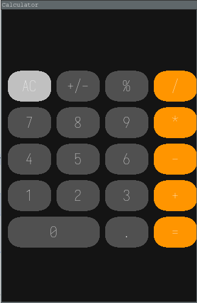

# Calculator with Objective C
   # Prerequisite:
   - Linux
   - gcc
   - gnustep-base and config
   - install SDL2
   - install SDL2_ttf
   - install SDL2_gfx
   
   # How to build:
   - make
   
   # How to run:
   - ./calc

